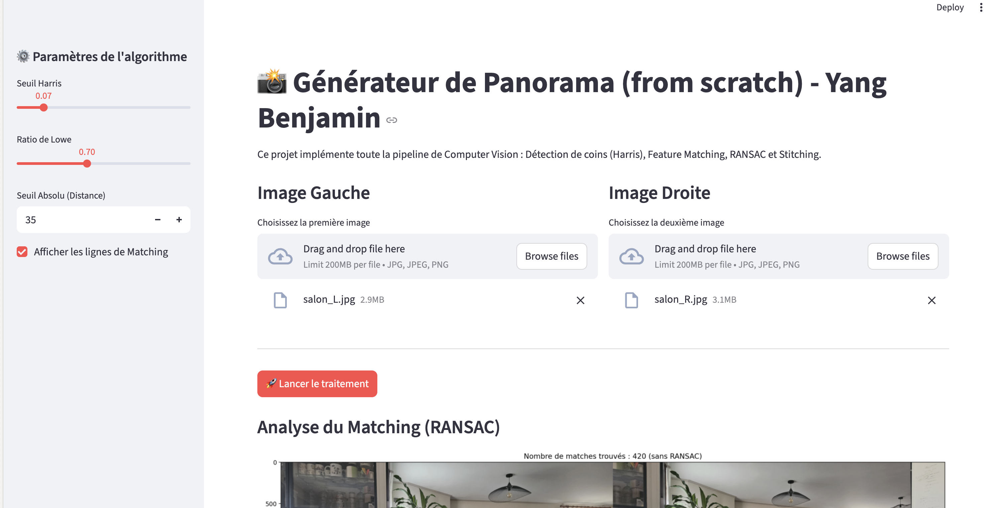
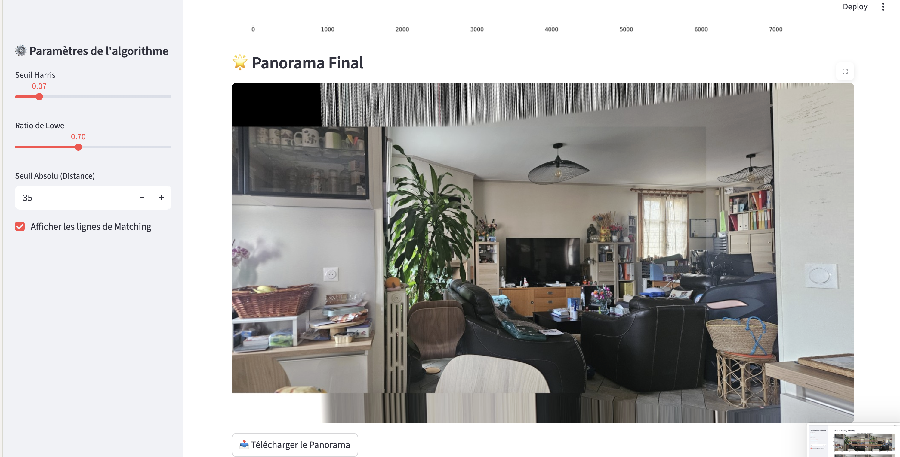

# The Panorama & Image Stitching Project
### Yang Benjamin

This project is the culmination of my journey into fundamental Computer Vision. After mastering local feature extraction with Harris Corner Detection, I am now tackling **geometric transformations and image alignment**. It is a deep dive into projective geometry, robust statistical estimation, and the intricacies of discrete pixel manipulation to seamlessly stitch two images together from scratch.

## Why this project?

In modern photography and mapping, creating panoramas is a basic feature of any smartphone. However, the underlying mathematics are surprisingly complex. My goal with this project was to step away from black-box functions like `cv2.findHomography` or `cv2.warpPerspective` and truly understand how to:
1. **Model perspective**: Mathematically define how a camera's viewpoint shifts and how to map pixels from one plane to another using homogeneous coordinates.
2. **Master robust estimation**: Discover how to find a needle in a haystack—extracting a perfect mathematical model from a dataset highly polluted with false matches and noise.
3. **Handle discrete spaces**: Overcome the purely programmatic challenges of translating infinite mathematical planes into finite, zero-indexed Numpy arrays without crashing.

## Approach & Implementation

As with my previous computer vision projects, I built the pipeline step-by-step, starting from raw pixel analysis up to complex geometric projections.

### 1. Feature Matching & The Lowe's Ratio Test
Before stitching anything, the algorithm needs to know which points in Image A correspond to Image B. I used my custom Harris Corner detector and extracted normalized patch descriptors for each point. 
To avoid false matches in repetitive textures (like a tiled kitchen), I implemented Lowe's Ratio Test. Instead of just taking the closest match, we ensure the closest match $d_1$ is significantly better than the second-closest match $d_2$:
$$\text{Ratio} = \frac{d_1}{d_2 + \epsilon} \le \text{threshold}$$
This effectively filters out ambiguous points before the geometry step.

### 2. Projective Geometry and Homography via SVD
To warp the right image onto the left one, we need a Homography matrix $H$. This $3 \times 3$ matrix describes the perspective transformation between two planes.
$$p_{dst} \sim H p_{src}$$
$$\begin{bmatrix} x' \\ y' \\ w' \end{bmatrix} = \begin{bmatrix} h_{11} & h_{12} & h_{13} \\ h_{21} & h_{22} & h_{23} \\ h_{31} & h_{32} & h_{33} \end{bmatrix} \begin{bmatrix} x \\ y \\ 1 \end{bmatrix}$$
To find $H$, we need at least 4 corresponding points. I implemented the Direct Linear Transform (DLT) algorithm, rearranging the coordinates into a system of equations $Ah = 0$ and solving for the eigenvector corresponding to the smallest eigenvalue using Singular Value Decomposition (SVD) via `np.linalg.svd`.

### 3. RANSAC: Finding the Truth in the Noise
Even with Lowe's ratio, some feature matches are completely wrong (outliers). If we compute SVD on all points, the outliers will severely distort the panorama. 
I implemented RANSAC (Random Sample Consensus) to solve this:
1. Randomly pick 4 pairs of points.
2. Compute a temporary matrix $H$.
3. Project all points from Image 1 using $H$ and measure the Euclidean distance to their actual matches in Image 2:
$$d = \sqrt{(x_{proj} - x_{dst})^2 + (y_{proj} - y_{dst})^2}$$
4. Count how many points fall under a strict error threshold (the inliers).
After thousands of iterations, the algorithm keeps the $H$ that produced the highest consensus, perfectly filtering out the geometric lies.

### 4. Warping and the Bounding Box Challenge
The final step—image warping—proved to be the most challenging computationally. When an image is transformed by $H$, its corners can land in negative coordinates (e.g., $x = -500$). Since Numpy arrays cannot have negative indices, trying to place this image directly results in broadcast errors or cropped data.
To solve this, I calculated a global bounding box for the new perspective and generated a Translation matrix $T$ to shift all negative coordinates into the positive space:
$$H_{final} = T \cdot H$$
By applying bilinear interpolation on the inverse mapping $P_{src} = H_{final}^{-1} P_{dst}$, I successfully mapped the source pixels to the new canvas without leaving sub-pixel gaps.

## Key Takeaways

### The Coordinate System Trap
The hardest lesson of this project was navigating the conflict between geometric logic and programmatic reality. Mathematical matrices use $(x, y)$ (width, height), while Numpy accesses memory via `[row, col]` (height, width). Consistently transposing these mental models—and using precise slicing to avoid `ValueError: could not broadcast`—was a steep but necessary learning curve.

### Robustness Over Perfection
RANSAC is a beautiful reminder that in computer science, we rarely have perfect data. Instead of trying to write a flawless matching algorithm, it is often much more powerful to write an algorithm that expects failure and knows how to mathematically isolate the truth from the noise.

## Current Limitations & Future Work
While the pipeline is fully functional from scratch, it is not yet perfect. The current implementation prioritizes mathematical clarity over deep computational optimization, meaning the warping and matching steps can be slow on high-resolution images. Additionally, hyperparameters—such as the Lowe's ratio, Harris corner thresholds, and RANSAC distances—are currently manually tuned and not globally optimal for all types of images and lighting conditions. Future iterations will focus on further vectorizing the bottlenecks and implementing adaptive thresholding.

---

*Yang Benjamin, Feb 2026*